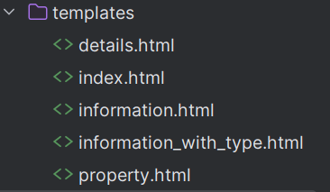

# LFB Incident data
This app uses Python and flask to display fire alarm information using LFB data

## Database creation
The data comes from two files. The LFB Incident data from 2018.csv
file includes the case ID, the time of occurrence and the zip code of
the address where the fire occurred, and the ID of the property type.The property.csv file contains the property ID and 
property type.The database contains two tables. The incident table contains content from LFB Incident data from 2018.csv, 
where incident_id is the primary key and property_id is the foreign key, used to connect with property_type. property_type 
contains content from property.csv where the primary key is property_id. setupdb.py is used to generate this database.

## Building the web components
The template contains the following parts

index.html is the homepage, with three hyperlinks. Information will jump to information.html, displaying content from The
LFB Incident data from 2018.csv. Each incident_id is a hyperlink that will jump to detail.html, which can be used to view 
the specific property type of each case. All property type will jump to property.html, showing all property types. Display 
with property type will jump to information_with_type.html, which will match all fire information with property types one-to-one 
and display them.